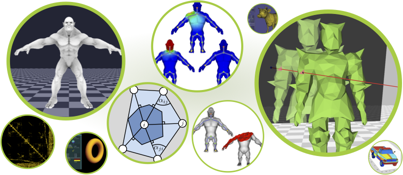

# libigl - A simple C++ geometry processing library
[](https://travis-ci.org/libigl/libigl)
[](https://ci.appveyor.com/project/danielepanozzo/libigl-6hjk1)


<https://github.com/libigl/libigl/>

> Get started with:
>
```bash
git clone --recursive https://github.com/libigl/libigl.git
```

libigl is a simple C++ geometry processing library. We have a wide
functionality including construction of sparse discrete differential geometry
operators and finite-elements matrices such as the cotangent Laplacian and
diagonalized mass matrix, simple facet and edge-based topology data structures,
mesh-viewing utilities for OpenGL and GLSL, and many core functions for matrix
manipulation which make [Eigen](http://eigen.tuxfamily.org) feel a lot more
like MATLAB.

It is **a header-only library**. You do not need to compile anything to use,
just include igl headers (e.g. `#include <igl/cotmatrix.h>`) and run.  Each
header file contains a single function (e.g. `igl/cotmatrix.h` contains
`igl::cotmatrix()`). Most are tailored to operate on a generic triangle mesh
stored in an n-by-3 matrix of vertex positions `V` and an m-by-3 matrix of
triangle indices `F`.

_Optionally_ the library may also be [pre-compiled](optional/) into a statically
linked library, for faster compile times with your projects. This only effects
compile time (run-time performance and behavior is identical). If in doubt, use
the header-only default mode: (i.e. just include the headers you want to use).

We use the [Eigen](http://eigen.tuxfamily.org) library heavily in our code. Our
group prototypes a lot in MATLAB, and we have a useful [MATLAB to libigl+Eigen
conversion table](matlab-to-eigen.html).

We regularly test compiling our library on Mac OS X with clang, Linux with gcc
and Windows with Visual Studio 2015 Community Edition.

## Tutorial

As of version 1.0, libigl includes an introductory
[tutorial](http://libigl.github.io/libigl/tutorial/tutorial.html) that covers many functionalities.

## libigl example project

We provide a [blank project example](https://github.com/libigl/libigl-example-project) showing how to use libigl and cmake. Feel free and encouraged to copy or fork this project as a way of starting a new personal project using libigl.

## Installation

Libigl is a **header-only** library. You do **not** need to build anything to
install.  Simply add `libigl/include` to your include path and include relevant
headers.  Here is a small "Hello, World" program:

```cpp
#include <igl/cotmatrix.h>
#include <Eigen/Dense>
#include <Eigen/Sparse>
#include <iostream>
int main()
{
  Eigen::MatrixXd V(4,2);
  V<<0,0,
     1,0,
     1,1,
     0,1;
  Eigen::MatrixXi F(2,3);
  F<<0,1,2,
     0,2,3;
  Eigen::SparseMatrix<double> L;
  igl::cotmatrix(V,F,L);
  std::cout<<"Hello, mesh: "<<std::endl<<L*V<<std::endl;
  return 0;
}
```

If you save this in `hello.cpp`, then you could compile this with (assuming
Eigen is installed in `/usr/local/include/eigen3`):

```bash
g++ -std=c++11 -I/usr/local/include/eigen3 -I./libigl/include/ hello.cpp -o hello
```

Running `./hello` would then produce

```
Hello, mesh:
 0.5  0.5
-0.5  0.5
-0.5 -0.5
 0.5 -0.5
```

## Dependencies
Dependencies are on a per-include basis and the majority of the functions in
libigl depends only on the [Eigen](http://eigen.tuxfamily.org) library.

For more information see our [tutorial](tutorial/tutorial.html).

### Optional dependencies

Libigl compartmentalizes its **optional** dependences via its directory
organization in the `include/` folder. All header files located _directly_ in
the `include/igl/` folder have only stl and Eigen as dependencies. For example,
all of the headers that depend on CGAL are located in `include/igl/cgal`. For a
full list of _optional_ dependencies check `optional/CMakeLists.txt`.

### GCC and the optional CGAL dependency
The `include/igl/cgal/*.h` headers depend on CGAL. It has come to our attention
that CGAL does not work properly with GCC 4.8. To the best of our knowledge,
GCC 4.7 and clang will work correctly.

### OpenMP and Windows
Some of our functions will take advantage of OpenMP if available. However, it
has come to our attention that Visual Studio + Eigen + OpenMP does not work
properly. Since we use OpenMP only to improve performance, we recommend
avoiding OpenMP on Windows or proceeding with caution.

## Download
You can keep up to date by cloning a read-only copy of our GitHub
[repository](https://github.com/libigl).

## Known Issues
We rely heavily on Eigen. Nearly all inputs and outputs are Eigen matrices of
some kind. However, we currently _only_ officially support Eigen's default
column-major ordering. That means, we **do not** expect our code to work for
matrices using the `Eigen::RowMajor` flag. If you can, change definitions like:

```cpp
Eigen::Matrix<double, Eigen::Dynamic, 3, Eigen::RowMajor> A;
```

to

```cpp
Eigen::Matrix<double, Eigen::Dynamic, 3, Eigen::ColMajor> A;
// or simply
Eigen::Matrix<double, Eigen::Dynamic, 3> A;
```

We hope to fix this, or at least identify which functions are safe (many of
them probably work just fine). This requires setting up unit testing, which is
a major _todo_ for our development.

## Git Submodules
Libigl uses git submodules for its _optional_ dependencies,
in particular, those needed by the OpenGL viewer to run the examples in the
[tutorial](tutorial/tutorial.html). Git submodules allow use to treat clones of
other libraries as sub-directories within ours while separating our commits.
Read the [documentation](http://git-scm.com/docs/git-submodule) for a detailed
explanation, but essentially our libigl repo stores a hash for each of its
subrepos containing which version to update to. When a change is introduced in
a dependencies repo we can incorporate that change by pulling in our sub-repo
and updating (i.e.  committing) that change to the hash.

When pulling new changes to libigl it's also a good idea to update changes to
subrepos:

```bash
git pull
git submodule update --recursive
```

## Unit testing

Libigl maintains [separate
repository](https://github.com/libigl/libigl-unit-tests) for unit testing.

## How to contribute

If you are interested in joining development, please fork the repository and
submit a [pull request](https://help.github.com/articles/using-pull-requests/)
with your changes.

## License
libigl is primarily [MPL2](http://www.mozilla.org/MPL/2.0/) licensed
([FAQ](http://www.mozilla.org/MPL/2.0/FAQ.html)). Some files contain
third-party code under other licenses. We're currently in the processes of
identifying these and marking appropriately.

## Attribution
If you use libigl in your academic projects, please cite the papers we
implement as appropriate. To cite the library in general, you could use this
BibTeX entry:

```bibtex
@misc{libigl,
  title = {{libigl}: A simple {C++} geometry processing library},
  author = {Alec Jacobson and Daniele Panozzo and others},
  note = {http://libigl.github.io/libigl/},
  year = {2016},
}
```

## Projects/Universities using libigl
Libigl is used by many research groups around the world. In 2015, it won the
Eurographics/ACM Symposium on Geometry Processing software award. Here are a
few labs/companies/institutions using libigl:

 - [Activision](http://www.activision.com)
 - [Adobe Research](http://www.adobe.com/technology/)  
 - [Electronic Arts, Inc](http://www.ea.com)
 - [Epic Games](https://epicgames.com)
 - [Google Research](https://research.google.com)
 - [Mesh](http://meshconsultants.ca/), consultants, Canada
 - [Pixar Research](http://graphics.pixar.com/research/)
 - [Spine by Esoteric Software](http://esotericsoftware.com/) is an animation tool dedicated to 2D characters.
 - Columbia University, [Columbia Computer Graphics Group](http://www.cs.columbia.edu/cg/), USA
 - [Cornell University](http://www.graphics.cornell.edu/), USA
 - [Czech Technical University in Prague](http://dcgi.felk.cvut.cz/), Czech
 - EPF Lausanne, [Computer Graphics and Geometry Laboratory](http://lgg.epfl.ch/people.php), Switzerland
 - ETH Zurich, [Interactive Geometry Lab](http://igl.ethz.ch/) and [Advanced Technologies Lab](http://ait.inf.ethz.ch/), Swizterland
 - George Mason University, [CraGL](http://cs.gmu.edu/~ygingold/), USA
 - [Hong Kong University of Science and Technology](http://www.ust.hk/), Hong Kong
 - [Inria, Université Grenoble Alpes](https://www.inria.fr/centre/grenoble/), France
 - [Jiangnan university](http://english.jiangnan.edu.cn), China
 - [National Institute of Informatics](http://www.nii.ac.jp/en/), Japan
 - New York University, [Media Research Lab](http://mrl.nyu.edu/), USA
 - NYUPoly, [Game Innovation Lab](http://game.engineering.nyu.edu/), USA
 - [TU Berlin](https://www.cg.tu-berlin.de), Germany
 - [TU Delft](http://www.tudelft.nl/en/), Netherlands
 - [TU Wien](https://www.tuwien.ac.at/en/tuwien_home/), Austria
 - [Telecom ParisTech](http://www.telecom-paristech.fr/en/formation-et-innovation-dans-le-numerique.html), Paris, France
 - [Utrecht University](http://www.staff.science.uu.nl/~vaxma001/), The Netherlands
 - [Universidade Federal de Santa Catarina](http://mtm.ufsc.br/~leo/), Brazil
 - [University College London](http://vecg.cs.ucl.ac.uk/), England
 - [University of California Berkeley](http://vis.berkeley.edu/), USA
 - [University of Cambridge](http://www.cam.ac.uk/), England
 - [University of Pennsylvania](http://cg.cis.upenn.edu/), USA
 - [University of Texas at Austin](http://www.cs.utexas.edu/users/evouga/), USA
 - [University of Toronto](http://dgp.toronto.edu), Canada
 - [University of Victoria](https://www.csc.uvic.ca/Research/graphics/), Canada
 - [University of Wisconsin-Eau Claire](http://www.uwec.edu/computer-science/), USA
 - [Università della Svizzera Italiana](http://www.usi.ch/en), Switzerland
 - [Université Toulouse III Paul Sabatier](http://www.univ-tlse3.fr/), France
 - [Zhejiang University](http://www.math.zju.edu.cn/cagd/), China


## Contact

Libigl is a group endeavor led by [Alec
Jacobson](http://www.cs.toronto.edu/~jacobson/) and [Daniele
Panozzo](http://www.inf.ethz.ch/personal/dpanozzo/). Please [contact
us](mailto:alecjacobson@gmail.com,daniele.panozzo@gmail.com) if you have
questions or comments. For troubleshooting, please post an
[issue](https://github.com/libigl/libigl/issues) on github.

If you're using libigl in your projects, quickly [drop us a
note](mailto:alecjacobson@gmail.com,daniele.panozzo@gmail.com). Tell us who you
are and what you're using it for. This helps us apply for funding and justify
spending time maintaining this.

If you find bugs or have problems please use our [github issue tracking
page](https://github.com/libigl/libigl/issues).

## Copyright
2016 Alec Jacobson, Daniele Panozzo, Christian Schüller, Olga Diamanti, Qingnan
Zhou, Sebastian Koch, Amir Vaxman, Nico Pietroni, Stefan Brugger, Kenshi Takayama, Wenzel Jakob, Nikolas De
Giorgis, Luigi Rocca, Leonardo Sacht, Kevin Walliman, Olga Sorkine-Hornung, and others.

Please see individual files for appropriate copyright notices.
