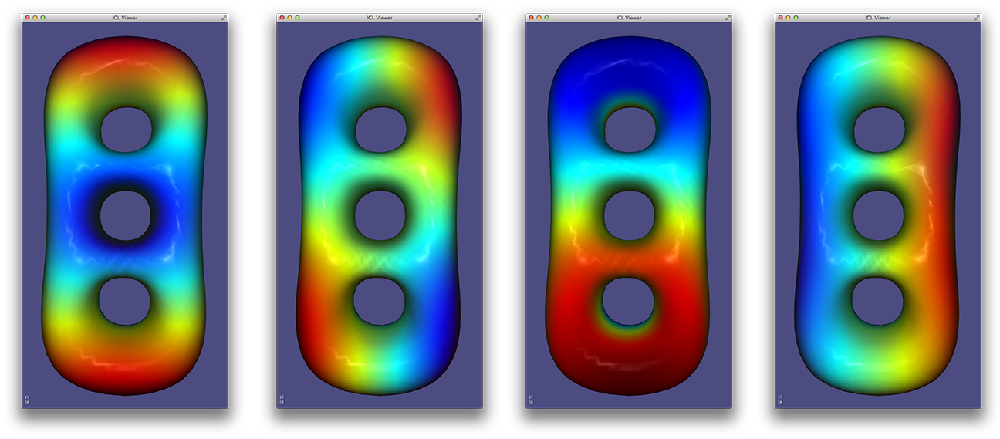
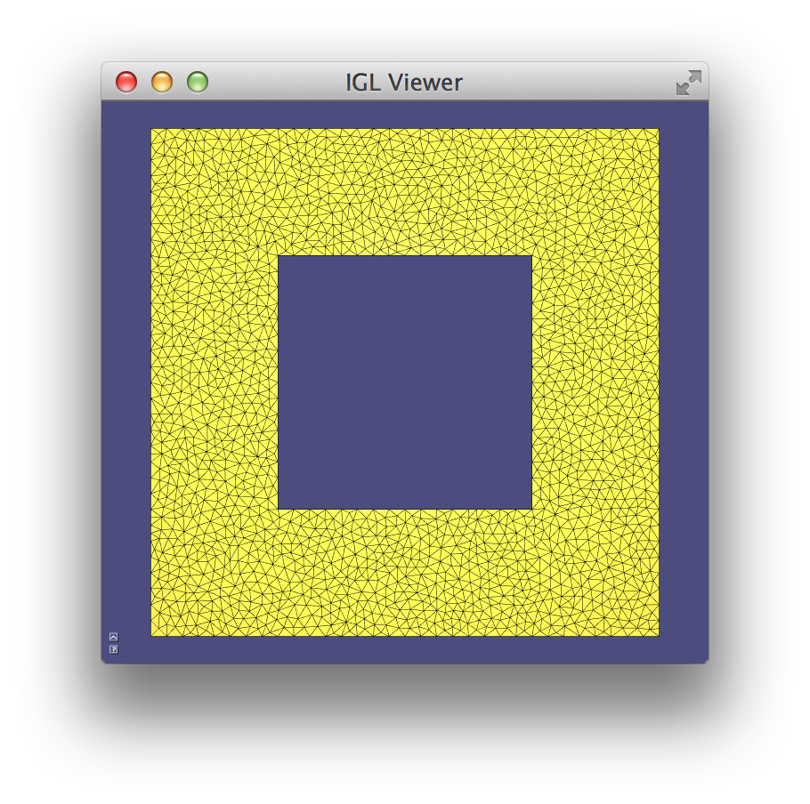

# Chapter 6: External libraries

An additional positive side effect of using matrices as basic types is that it
is easy to exchange data between libigl and other software and libraries.

## State serialization

Geometry processing applications often require a considerable amount of
computational time and/or manual input. Serializing the state of the application
is a simple strategy to greatly increase the development efficiency. It allows
to quickly start debugging just before the crash happens, avoiding to wait for
the precomputation to take place every time and it also makes your experiments
reproducible, allowing to quickly test algorithms variants on the same input
data.

Serialization is often not considered in geometry processing due to the extreme
difficulty in serializing pointer-based data structured, such as an half-edge
data structure ([OpenMesh](http://openmesh.org), [CGAL](http://www.cgal.org)),
or a pointer based indexed structure
([VCG](http://vcg.isti.cnr.it/~cignoni/newvcglib/html/)).

In libigl, serialization is much simpler, since the majority of the functions
use basic types, and pointers are used in very rare cases (usually to interface
with external libraries). Libigl bundles a simple and self-contained binary and
XML serialization framework, that drastically reduces the overhead required to
add serialization to your applications.

To de-/serialize a set of variables use the following method:

```cpp
#include "igl/serialize.h"

bool b = true;
unsigned int num = 10;
std::vector<float> vec = {0.1,0.002,5.3};

// use overwrite = true for the first serialization to create or overwrite an
// existing file
igl::serialize(b,"B","filename",true);
// append following serialization to existing file
igl::serialize(num,"Number","filename");
igl::serialize(vec,"VectorName","filename");

// deserialize back to variables
igl::deserialize(b,"B","filename");
igl::deserialize(num,"Number","filename");
igl::deserialize(vec,"VectorName","filename");
```

Currently all fundamental data types (bool, int, float, double, ...) are
supported, as well as std::string, basic `STL` containers, dense and sparse
Eigen matrices and nestings of those.  Some limitations apply to pointers.
Currently, loops or many to one type of link structures are not handled
correctly. Each pointer is assumed to point to a different independent object.
Uninitialized pointers must be set to `nullptr` before de-/serialization to
avoid memory leaks. Cross-platform issues like little-, big-endianess is
currently not supported.  To make user defined types serializable, just derive
from `igl::Serializable` and trivially implementing the `InitSerialization`
method.

Assume that the state of your application is a mesh and a set of integer ids:

```cpp
#include "igl/serialize.h"

struct State : public igl::Serializable
{
  Eigen::MatrixXd V;
  Eigen::MatrixXi F;
  std::vector<int> ids;

  void InitSerialization()
  {
    this->Add(V  , "V");
    this->Add(F  , "F");
    this->Add(ids, "ids");
  }
};
```

If you need more control over the serialization of your types, you can override
the following functions or directly inherit from the interface
`igl::SerializableBase`.

```cpp
bool Serializable::PreSerialization() const;
void Serializable::PostSerialization() const;
bool Serializable::PreDeserialization();
void Serializable::PostDeserialization();
```

Alternatively, if you want a non-intrusive way of serializing your state you can
overload the following functions:

```cpp
namespace igl
{
  namespace serialization
  {
    template <> inline void serialize(const State& obj,std::vector<char>& buffer)
    {
      ::igl::serialize(obj.V,std::string("V"),buffer);
      ::igl::serialize(obj.F,std::string("F"),buffer);
      ::igl::serialize(obj.ids,std::string("ids"),buffer);
    }
    template <> inline void deserialize(State& obj,const std::vector<char>& buffer)
    {
      ::igl::deserialize(obj.V,std::string("V"),buffer);
      ::igl::deserialize(obj.F,std::string("F"),buffer);
      ::igl::deserialize(obj.ids,std::string("ids"),buffer);
    }
  }
}
```

Equivalently, you can use the following macros:

```cpp
SERIALIZE_TYPE(State,
 SERIALIZE_MEMBER(V)
 SERIALIZE_MEMBER(F)
 SERIALIZE_MEMBER_NAME(ids,"ids")
)
```

All the former code is for binary serialization which is especially useful if
you have to handle larger data where the loading and saving times become more
important.  For cases where you want to read and edit the serialized data by
hand we provide a serialization to XML files which is based on the library
[tinyxml2](https://github.com/leethomason/tinyxml2).  There you also have the
option to create a partial binary serialization of your data by using the binary
parameter, exposed in the function `serialize_xml()`:

```cpp
#include "igl/xml/serialize_xml.h"

int number;

// binary = false, overwrite = true
igl::serialize_xml(vec,"VectorXML",xmlFile,false,true);
// binary = true, overwrite = true
igl::serialize_xml(vec,"VectorBin",xmlFile,true,true);
igl::deserialize_xml(vec,"VectorXML",xmlFile);
igl::deserialize_xml(vec,"VectorBin",xmlFile);
```

For user defined types derive from `XMLSerializable`.

The code snippets above are extracted from [Example
601]({{ repo_url }}/tutorial/601_Serialization/main.cpp). We strongly suggest that you make the entire
state of your application always serializable since it will save you a lot of
troubles when you will be preparing figures for a scientific report. It is very
common to have to do small changes to figures, and being able to serialize the
entire state just before you take screenshots will save you many painful hours
before a submission deadline.

## Mixing Matlab code

Libigl can be interfaced with Matlab to offload numerically heavy computation
to a Matlab script. The major advantage of this approach is that you will be
able to develop efficient and complex user-interfaces in C++, while exploring
the syntax and fast protototyping features of matlab. In particular, the use of
an external Matlab script in a libigl application allows to change the Matlab
code while the C++ application is running, greatly increasing coding
efficiency.

We demonstrate how to integrate Matlab in a libigl application in [Example
602]({{ repo_url }}/tutorial/602_Matlab/main.cpp). The example uses Matlab to compute the
Eigenfunctions of the discrete Laplacian operator, relying on libigl for mesh
IO, visualization and for computing the Laplacian operator.

Libigl can connect to an existing instance of Matlab (or launching a new one on
Linux/MacOSX) using:

```cpp
igl::mlinit(&engine);
```

The cotangent Laplacian is computed using igl::cotmatrix and uploaded to the
Matlab workspace:

```cpp
igl::cotmatrix(V,F,L);
igl::mlsetmatrix(&engine,"L",L);
```

It is now possible to use any Matlab function on the data. For example, we can
see the sparsity pattern of L using spy:

```cpp
igl::mleval(&engine,"spy(L)");
```


The results of Matlab computations can be returned back to the C++ application

```cpp
igl::mleval(&engine,"[EV,~] = eigs(-L,10,'sm')");
igl::mlgetmatrix(&engine,"EV",EV);
```

and plotted using the libigl viewer.




### Saving a Matlab workspace
To aid debugging, libigl also supplies functions to write Matlab `.mat`
"Workspaces". This C++ snippet saves a mesh and it's sparse Laplacian matrix to
a file:

```cpp
igl::readOFF(TUTORIAL_SHARED_PATH "/fertility.off", V, F);
igl::cotmatrix(V,F,L);
igl::MatlabWorkspace mw;
mw.save(V,"V");
mw.save_index(F,"F");
mw.save(L,"L");
mw.write("fertility.mat");
```

Then this workspace can be loaded into a Matlab IDE:

```matlab
load fertility.mat
```

The `igl::MatlabWorkspace` depends on Matlab libraries to compile and run,
but---in contrast to the engine routines above---will avoid launching a Matlab
instance upon execution.

### Dumping Eigen matrices to copy and paste into Matlab
Eigen supplies a sophisticated API for printing its matrix types to the screen.
Libigl has wrapped up a particularly useful formatting which makes it simple to
copy standard output from a C++ program into a Matlab IDE. The code:

```cpp
igl::readOFF(TUTORIAL_SHARED_PATH "/2triangles.off", V, F);
igl::cotmatrix(V,F,L);
std::cout<<igl::matlab_format(V,"V")<<std::endl;
std::cout<<igl::matlab_format((F.array()+1).eval(),"F")<<std::endl;
std::cout<<igl::matlab_format(L,"L")<<std::endl;
```

produces the output:

```matlab
V = [
  0 0 0
  1 0 0
  1 1 1
  2 1 0
];
F = [
  1 2 3
  2 4 3
];
LIJV = [
1  1    -0.7071067811865476
2  1     0.7071067811865475
3  1  1.570092458683775e-16
1  2     0.7071067811865475
2  2     -1.638010440969447
3  2     0.6422285251880865
4  2     0.2886751345948129
1  3  1.570092458683775e-16
2  3     0.6422285251880865
3  3    -0.9309036597828995
4  3     0.2886751345948129
2  4     0.2886751345948129
3  4     0.2886751345948129
4  4    -0.5773502691896258
];
L = sparse(LIJV(:,1),LIJV(:,2),LIJV(:,3));
```

which is easily copied and pasted into Matlab for debugging, etc.

## Calling libigl functions from Matlab

It is also possible to call libigl functions from matlab, compiling them as MEX
functions. This can be used to offload to C++ code the computationally
intensive parts of a Matlab application.

We provide a wrapper for `igl::readOBJ` in [Example 603]({{ repo_url }}/tutorial/603_MEX/compileMEX.m).
We plan to provide wrappers for all our functions in the future, if you are
interested in this feature (or if you want to help implementing it) please let
us know.

## Triangulation of closed polygons

The generation of high-quality triangle and tetrahedral meshes is a very common
task in geometry processing. We provide wrappers in libigl to
[triangle](http://www.cs.cmu.edu/~quake/triangle.html) and
[Tetgen](http://wias-berlin.de/software/tetgen/).

A triangle mesh with a given boundary can be created with:

```cpp
igl::triangulate(V,E,H,V2,F2,"a0.005q");
```

where `E` is a set of boundary edges (#E by 2), `H` is a set of 2D positions of
points contained in holes of the triangulation (#H by 2) and (`V2`,`F2`) is the
generated triangulation. Additional parameters can be passed to `triangle`, to
control the quality: `"a0.005q"` enforces a bound on the maximal area of the
triangles and a minimal angle of 20 degrees. In [Example
604]({{ repo_url }}/tutorial/604_Triangle/main.cpp), the interior of a square (excluded a smaller square
in its interior) is triangulated.



## Tetrahedralization of closed surfaces

Similarly, the interior of a closed manifold surface can be tetrahedralized
using the function `igl::tetrahedralize` which wraps the Tetgen library ([Example
605]({{ repo_url }}/tutorial/605_Tetgen/main.cpp)):

```cpp
igl::tetrahedralize(V,F,"pq1.414", TV,TT,TF);
```


## Baking ambient occlusion

[Ambient occlusion](http://en.wikipedia.org/wiki/Ambient_occlusion) is a
rendering technique used to calculate the exposure of each point in a surface
to ambient lighting. It is usually encoded as a scalar (normalized between 0
and 1) associated with the vertice of a mesh.

Formally, ambient occlusion is defined as:

\\[ A_p = \frac{1}{\pi} \int_\omega V_{p,\omega}(n \cdot \omega) d\omega \\]

where $V_{p,\omega}$ is the visibility function at  p, defined to be zero if p
is occluded in the direction $\omega$ and one otherwise, and $d\omega$ is the
infinitesimal solid angle step of the integration variable $\omega$.

The integral is usually approximated by casting rays in random directions
around each vertex. This approximation can be computed using the function:

```cpp
igl::ambient_occlusion(V,F,V_samples,N_samples,500,AO);
```

that given a scene described in `V` and `F`, computes the ambient occlusion of
the points in `V_samples` whose associated normals are `N_samples`. The
number of casted rays can be controlled (usually at least 300-500 rays are
required to get a smooth result) and the result is returned in `AO`, as a
single scalar for each sample.

Ambient occlusion can be used to darken the surface colors, as shown in
[Example 606]({{ repo_url }}/tutorial/606_AmbientOcclusion/main.c)


## Screen Capture

Libigl supports read and writing to .png files via the
[stb image](http://nothings.org/stb_image.h) code.

With the viewer used in this tutorial, it is possible to render the scene in a
memory buffer using the function, `igl::opengl::ViewerCore::draw_buffer`:

```cpp
// Allocate temporary buffers for 1280x800 image
Eigen::Matrix<unsigned char,Eigen::Dynamic,Eigen::Dynamic> R(1280,800);
Eigen::Matrix<unsigned char,Eigen::Dynamic,Eigen::Dynamic> G(1280,800);
Eigen::Matrix<unsigned char,Eigen::Dynamic,Eigen::Dynamic> B(1280,800);
Eigen::Matrix<unsigned char,Eigen::Dynamic,Eigen::Dynamic> A(1280,800);

// Draw the scene in the buffers
viewer.core.draw_buffer(viewer.data,viewer.opengl,false,R,G,B,A);

// Save it to a PNG
igl::png::writePNG(R,G,B,A,"out.png");
```

In [Example 607]({{ repo_url }}/tutorial/607_ScreenCapture/main.cpp) a scene is rendered in a temporary
png and used to texture a quadrilateral.


## Locally Injective Maps

Extreme deformations or parametrizations with high-distortion might flip
elements.  This is undesirable in many applications, and it is possible to
avoid it by introducing a non-linear constraints that guarantees that the area
of every element remain positive.

Libigl can be used to compute Locally Injective Maps [^schuller_2013] using a variety of
deformation energies. A simple deformation of a 2D grid is computed in [Example
608]({{ repo_url }}/tutorial/608_LIM/main.cpp).


## Boolean operations on meshes

Constructive solid geometry (CSG) is a technique to define a complex surface as
the result of a number of set operations on solid regions of space: union,
intersection, set difference, symmetric difference, complement. Typically, CSG
libraries represent the inputs and outputs to these operations _implicitly_:
the solid $A$ is defined as the open set of points $\mathbf{x}$ for which some
function $a(\mathbf{x})$ "returns true". The surface of this shape is the
_closure_ of all points $x$ in $A$.

With this sort of representation, boolean
operations are straightforward. For example, the union of solids $A$ and $B$
is simply

$A \cup B = \{\mathbf{x} \left.\right|
  a(\mathbf{x}) \text{ or } b(\mathbf{x})\},$

the intersection is

$A \cap B = \{\mathbf{x} \left.\right|
  a(\mathbf{x}) \text{ and } b(\mathbf{x})\},$

the difference $A$ _minus_ $B$ is

$A \setminus B = \{\mathbf{x} \left.\right|
  a(\mathbf{x}) \text{ and _not_ } b(\mathbf{x})\},$

and the symmetric difference (XOR) is

$A \triangle B = \{\mathbf{x} \left.\right|
  \text{either } a(\mathbf{x}) \text{ or } b(\mathbf{x}) \text{ but not both }\}.$

Stringing together many of these operations, one can design quite complex
shapes. A typical CSG library might only keep explicit _base-case_
representations of canonical shapes: half-spaces, quadrics, etc.

In libigl, we do currently _not_ have an implicit surface representation.
Instead we expect our users to be working with _explicit_ triangle mesh
_boundary representations_ of solid shapes. CSG operations are much hard to
compute robustly with boundary representations, but are nonetheless useful.

To compute a boolean operation on a triangle mesh with vertices `VA` and
triangles `FA` and another mesh `VB` and `FB`, libigl first computes a unified
"mesh arrangement" (see [^zhou_2016][]) with vertices `V` and triangles `F` where all triangle-triangle
intersections have been "resolved". That is, edges and vertices are added
exactly at the intersection lines, so the resulting _non-manifold_ mesh `(V,F)`
has no self-intersections.

Then libigl labels each "cell" bounded by surfaces of the arrangement according
to its _winding number vector_: winding number with respect to each input mesh
$(w_A,w_B)$. Finally, according to the desired operation (e.g. union,
intersection) the boundary of the corresponding cells are extracted.

Calling libigl's boolean operations is simple. To compute the union of
`(VA,FA)` and `(VB,FB)` into a new mesh `(VC,FC)`, use:

```cpp
igl::copyleft::cgal::mesh_boolean(VA,FA,VB,FB,MESH_BOOLEAN_TYPE_UNION,VC,FC);
```

The following figure shows each boolean operation on two meshes.

 conducts boolean operations on the _Cheburashka_ (red) and _Knight_ (green). From left to right: union, intersection, set minus, symmetric difference (XOR), "resolve". Bottom row reveals inner surfaces, darker color indicates back-facing triangles.](images/cheburashka-knight-boolean.jpg)

The union, symmetric difference and "resolve" have the same outward
appearance, but differ in their treatment of internal structures. The union has
no internal surfaces: the triangles are not included in the output. The
symmetric difference is the same set of triangles as the "resolve", but
internal surfaces have been reversed in orientation, indicating that the solid
result of the operation. The "resolve" operation is not really a boolean
operation, it is simply the result of resolving all intersections and gluing
together coincident vertices, maintaining original triangle orientations.

Libigl also provides a wrapper `igl::copyleft::cork::mesh_boolean` to the
[cork](https://github.com/gilbo/cork), which is typically faster, but is not
always robust.

## CSG Tree

The [previous section](#boolean-operations-on-meshes) discusses using
`igl::copyleft::cgal::mesh_boolean` to compute the result of a _single_ boolean
operation on two input triangle meshes. When employing constructive solid
geometry (CSG) as a modeling paradigm, shapes are represented as the result of
many such binary operations. The sequence is stored in a binary tree.

Libigl uses exact arithmetic internally to construct the intermediary boolean
results robustly. "Rounding" this result to floating point (even double
precision) would cause problems if re-injected into a further boolean
operation. To facilitate CSG tree operations and encourage callers _not_ to
call `igl::copyleft::cgal::mesh_boolean` multiple times explicitly, libigl implements
a class `igl::copyleft::cgal::CSGTree`. Leaf nodes of this class are simply "solid"
meshes (otherwise good input to `igl::copyleft::cgal::mesh_boolean`). Interior nodes
of the tree combine two children with a boolean operation. Using the intializer
list constructor it is easy to hard-code specific tree constructions. Here's an
example taking the _intersection_ of a cube A and sphere B _minus_ the _union_
of three cylinders:

```cpp
// Compute result of (A ∩ B) \ ((C ∪ D) ∪ E)
igl::copyleft::cgal::CSGTree<MatrixXi> CSGTree =
  {{{VA,FA},{VB,FB},"i"},{{{VC,FC},{VD,FD},"u"},{VE,FE},"u"},"m"};
```


Example [610]({{ repo_url }}/tutorial/610_CSGTree/main.cpp) computes each intermediary CSG result and
then the final composite.

 computes  complex CSG Tree operation on 5 input meshes.](images/cube-sphere-cylinders-csg.gif)

## References

[^schuller_2013]: Christian Schüller, Ladislav Kavan, Daniele Panozzo, Olga Sorkine-Hornung.  [Locally Injective Mappings](http://igl.ethz.ch/projects/LIM/), 2013.
[^zhou_2016]: Qingnan Zhou, Eitan Grinspun, Denis Zorin. [Mesh Arrangements for Solid Geometry](https://www.google.com/search?q=Mesh+Arrangements+for+Solid+Geometry), 2016
