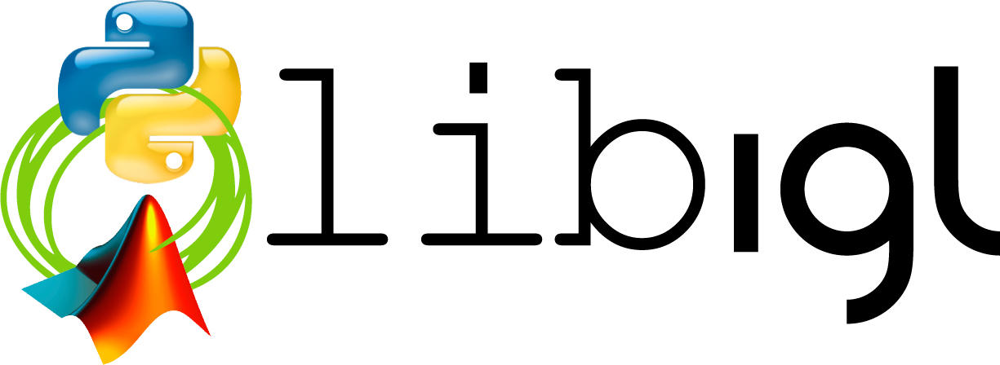
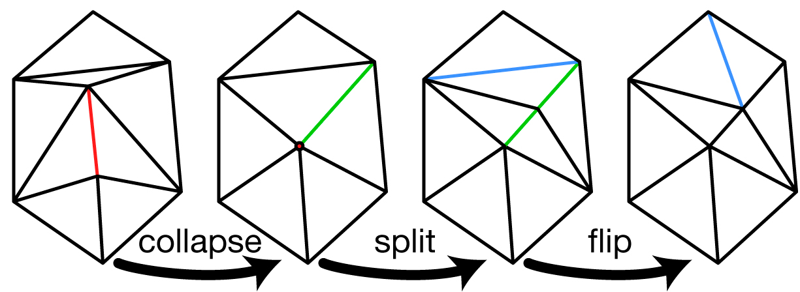

# [libigl](./index.html) - Google Summer of Code 2015 Project Ideas

## Automatic Generation of Python/MATLAB bindings

Libigl is a C++ library, but its functional interface make it very friendly to
wrapping individual functions for popular scripting languages like Python or
MATLAB. Since many libigl functions have the form "mesh in" --> "mesh out" or
"mesh with scalar field in" --> "scalar field out", we would like to develop an
_automatic_ routine for generating Python and MATLAB bindings for libigl
functions. This project has three parts: 1) determining the necessary mark up
(e.g. comments) inside libigl header files to determine the Python interface,
2) writing a program to parse this mark up and generate valid Python bindings
and compilation instructions, and 3) validating and testing these results on a
variety of functions in the library.

Student: [apply](https://www.google-melange.com/gsoc/homepage/google/gsoc2015)

Mentors: Alec Jacobson & Daniele Panozzo

## Topological Mesh Operations

Libigl avoids complicated mesh data-structures to ensure that its interface is
clean and easy to port into users' existing projects. Our mesh format is a
simple list of vertices and list of face indices to those vertices: `V` and
`F`.  We have a number of functions for _deforming_ a mesh: that is, modifying
the entries in `V`, but currently lack functions for _modifying_ the mesh's
topology: that is, modifying `F` and/or modifying the _size_ of `V`. This
project entails implementing _efficient_ routines for: edge collapse, edge
splitting, and edge flipping. The project will culminate in a routine combining
these core functions for surface remeshing.

Student: [apply](https://www.google-melange.com/gsoc/homepage/google/gsoc2015)

Mentors: Alec Jacobson & Daniele Panozzo

## Contact

Google Summer of Code projects with libigl are mentored by [Alec
Jacobson](http://www.cs.columbia.edu/~jacobson/) and [Daniele
Panozzo](http://www.inf.ethz.ch/personal/dpanozzo/). Please [contact
us](mailto:alecjacobson@gmail.com,daniele.panozzo@gmail.com) if you have
questions, comments or other ideas for a fun summer of hacking on libigl.
